# ShellKrypt Legacy

This repository contains the archived legacy implementation of ShellKrypt, a
local-only encrypted vault for credentials, project secrets, authenticator
codes, cards, and notes stored in user-controlled files.

> [!WARNING]
> ShellKrypt Legacy is no longer maintained, supported, or expected to receive
> security fixes. It remains available as a historical source snapshot. Do not
> treat it as the current ShellKrypt codebase or use it as the sole store for
> important or sensitive data.

The current ShellKrypt project is maintained separately at
[Akbulut55/ShellKrypt](https://github.com/Akbulut55/ShellKrypt). The projects
have independent histories, source trees, compatibility expectations, and
release status.

## Status

- Stage: archived legacy pre-1.0 implementation.
- Status note: Development ended at version `0.28.3`; no further releases,
  maintenance, support, compatibility work, or security fixes are planned.
- Main audience: Developers and privacy-conscious individuals who prefer local encrypted storage.
- Maintenance status: Unmaintained.

## Highlights

- Stores sensitive item payloads and vault-scoped activity details encrypted in local `.skvault` files.
- Provides dedicated workspaces for Web Logins, Credit Cards, API Keys, Project Secrets, Authenticator, Markdown Notes, Security Audit, backups, and Crypto Tools.
- Requires no ShellKrypt cloud account, hosted synchronization service, telemetry service, or remote recovery provider.

## Screenshots

<table>
  <tr>
    <td>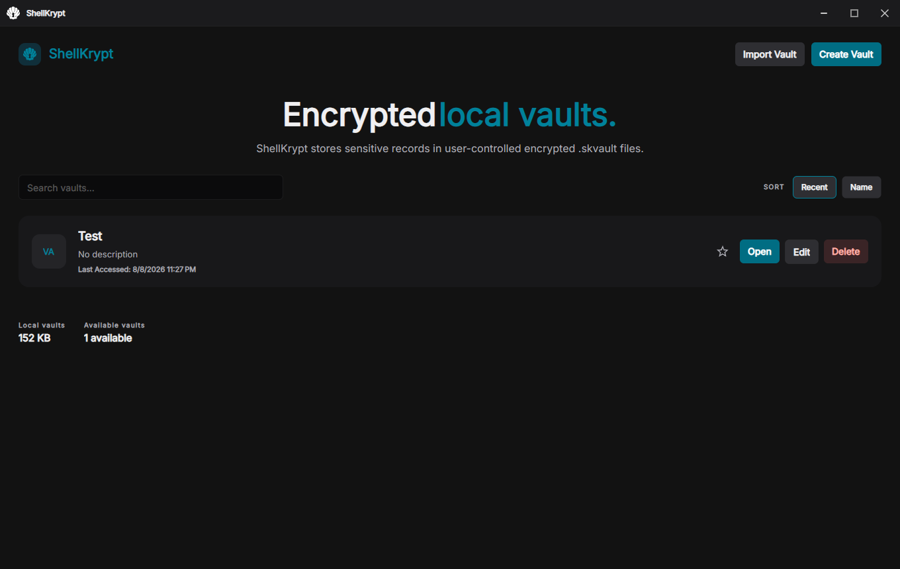</td>
    <td>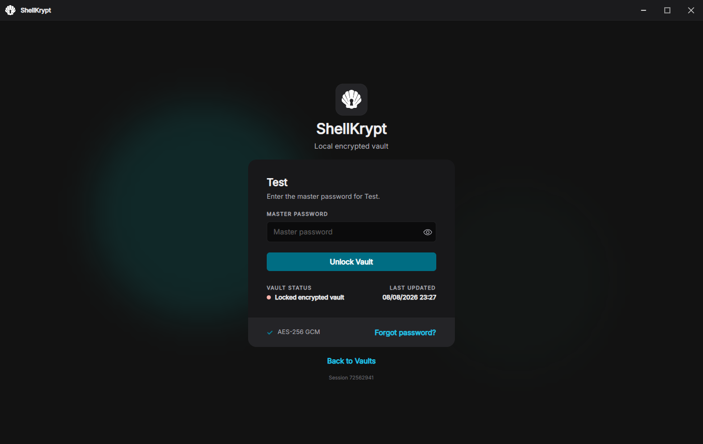</td>
    <td>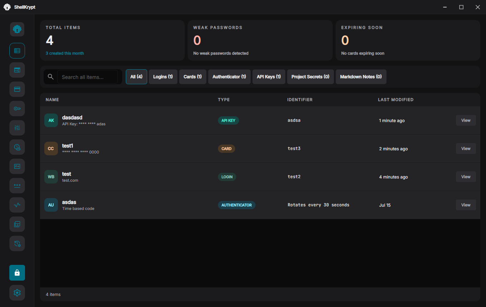</td>
  </tr>
  <tr>
    <td align="center">Vault launcher</td>
    <td align="center">Vault unlock</td>
    <td align="center">All Items</td>
  </tr>
  <tr>
    <td>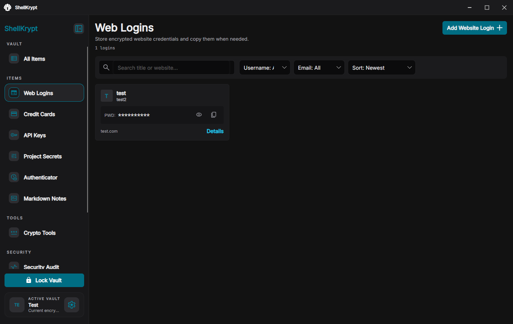</td>
    <td>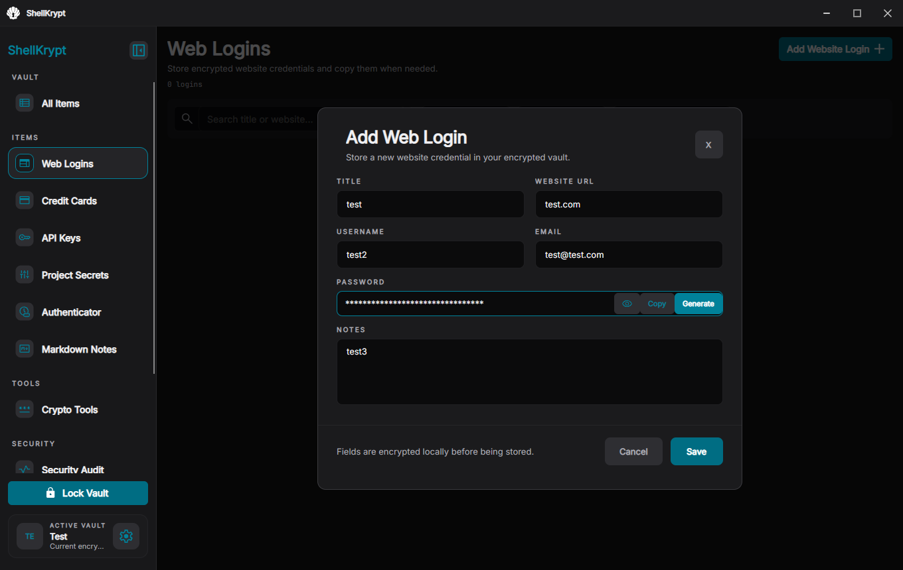</td>
    <td>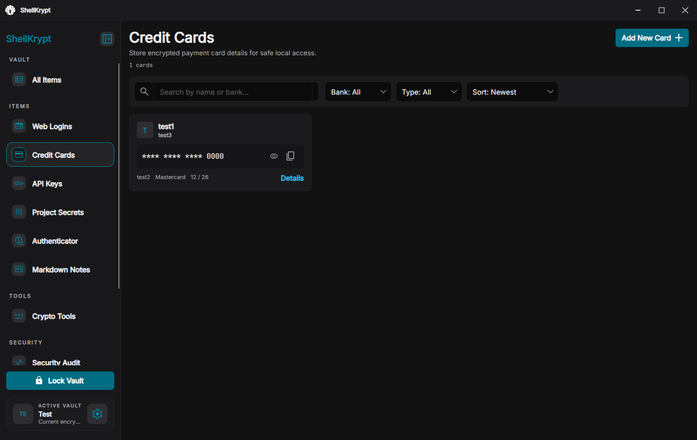</td>
  </tr>
  <tr>
    <td align="center">Web Logins</td>
    <td align="center">Add Web Login</td>
    <td align="center">Credit Cards</td>
  </tr>
  <tr>
    <td>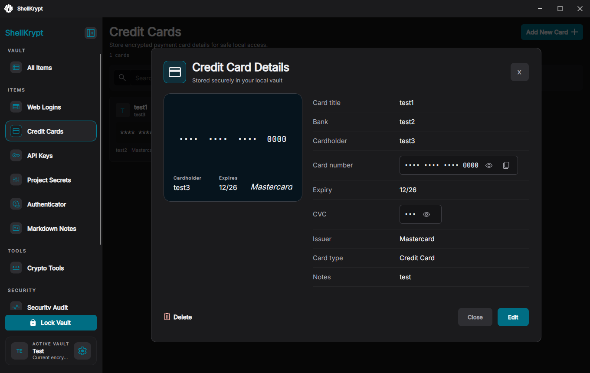</td>
    <td>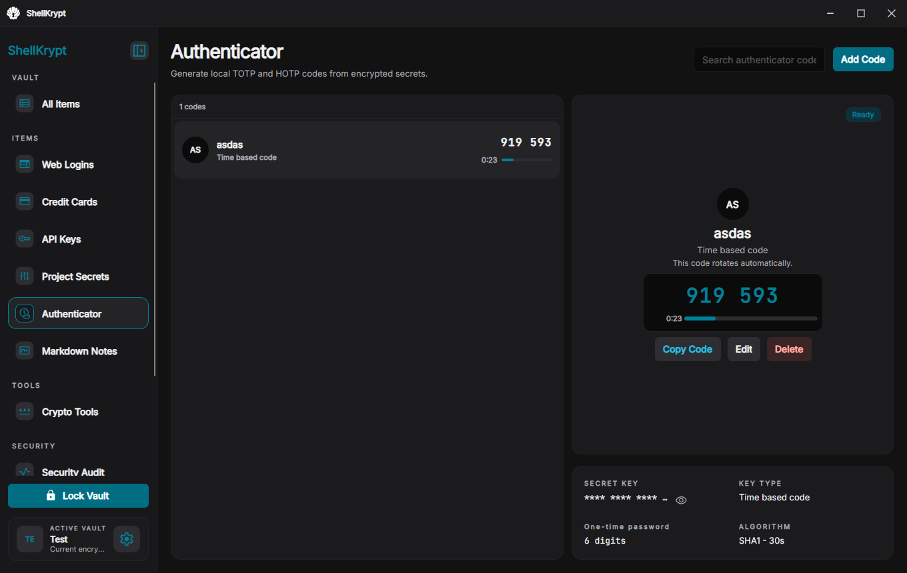</td>
    <td>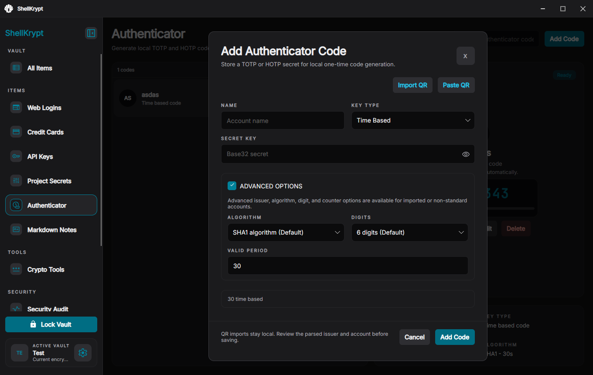</td>
  </tr>
  <tr>
    <td align="center">Credit Card details</td>
    <td align="center">Authenticator</td>
    <td align="center">Add Authenticator</td>
  </tr>
  <tr>
    <td>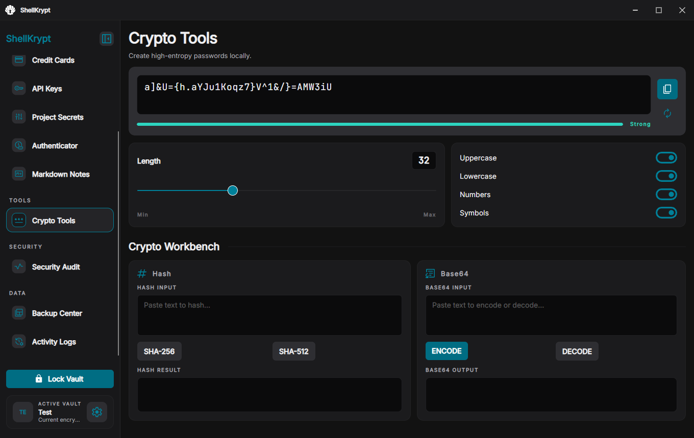</td>
    <td>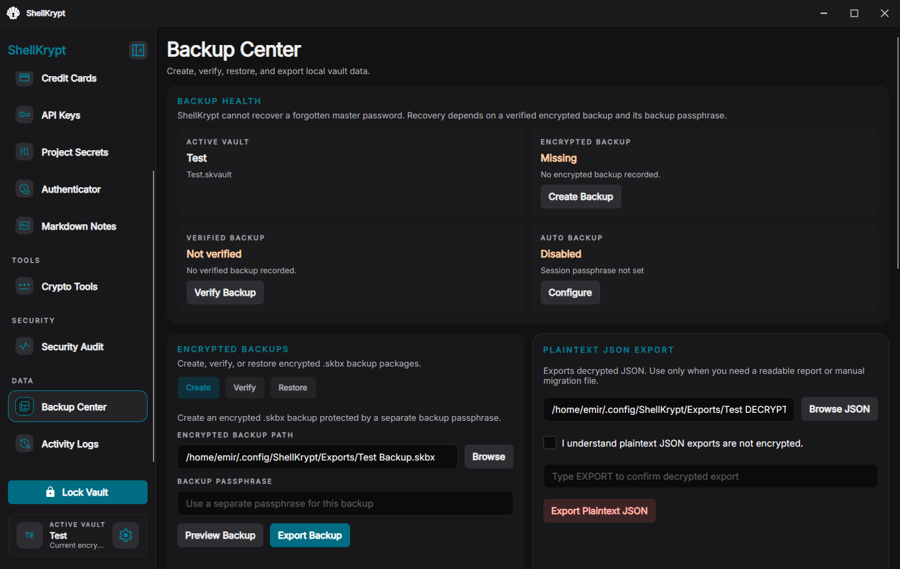</td>
    <td>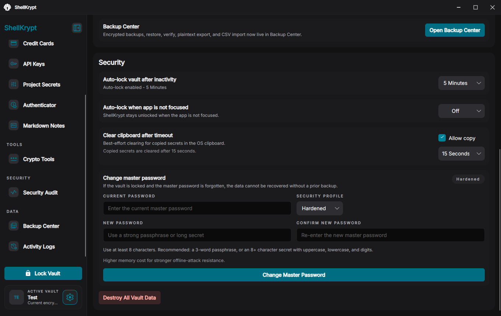</td>
  </tr>
  <tr>
    <td align="center">Crypto Tools</td>
    <td align="center">Backup Center</td>
    <td align="center">Settings</td>
  </tr>
</table>

## Requirements

- .NET 10 SDK.
- Windows or Linux desktop environment supported by Avalonia for the historical
  desktop build.

## Quick Start

```bash
dotnet restore ShellKrypt.slnx
dotnet run --project src/ShellKrypt.Desktop/ShellKrypt.Desktop.csproj
```

The commands above are retained for historical source builds. Dependency or
platform changes may prevent the archived project from building in the future.

## Example

```text
Create and reopen an encrypted vault
Input or action: Create a local vault, choose a master password, and add a web login.
Result: ShellKrypt encrypts the item in the .skvault file and restores it after a successful lock and unlock cycle.
```

## Limitations

- ShellKrypt Legacy is pre-1.0, has not received an external security audit,
  and should not be treated as a certified regulated-data platform.
- The project is archived and receives no security maintenance or support.
- Code signing, installers, update delivery, and public-release validation were
  not completed before development ended.

## Security Or Privacy Notes

- There is intentionally no password recovery. A forgotten master password or backup passphrase can make encrypted data permanently inaccessible.
- Plaintext exports and clipboard values leave the encrypted vault boundary; clipboard clearing is best-effort.
- ShellKrypt does not collect vault data through a ShellKrypt backend by default. Read [`SECURITY.md`](SECURITY.md), [`PRIVACY.md`](PRIVACY.md), and [`DISCLAIMER.md`](DISCLAIMER.md) before relying on the project.

## License

Copyright (C) 2026 the ShellKrypt author, publishing as Karvulas.

This legacy source snapshot is source-available commercial software under the
[`ShellKrypt Legacy Source License 1.0`](LICENSE). The source may be inspected,
compiled, and modified for personal noncommercial use, but redistribution and
commercial use require separate permission from the copyright owner.

ShellKrypt Legacy is not open-source software as defined by the Open Source
Initiative.

## Notes

- The final legacy desktop application version is `0.28.3`.
- This legacy repository is
  [Akbulut55/ShellKrypt-legacy](https://github.com/Akbulut55/ShellKrypt-legacy).
- The application represented by this source tree retains its historical
  `ShellKrypt` product and executable names.
- `ShellKrypt.slnx` is the canonical solution for the Desktop application and shared libraries.
- Historical distribution, support, names, and branding terms are described in
  [`NOTICE.md`](NOTICE.md).
